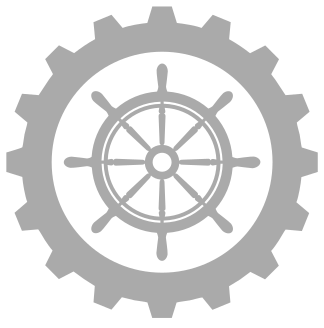

# tstate-machine
[](https://travis-ci.org/SoEasy/tstate-machine)

<br/>
StateMachine implementation on TypeScript. Works fine with ES6

## Overview
Class-based, declarative, strongly typed state machine with hard declared transitions and without autocomplete problems.

## Example
```javascript
import { IStateDeclaration, StateMachine } from 'tstate-machine';

class ButtonStateMachine extends StateMachine {
    // initial state
    text: string = 'do request';
    diisabled: boolean = false;

    // state declarations
    // From what state we inherit and in what states we can transit
    @StateMachine.extend(StateMachine.INTIAL, ['requestState'])
    mainState: IStateDeclaration<ButtonStateMachine> = {}; // no changes relative to parent(initial) state

    @StateMachine.extend('mainState', ['doneState'])
    requestState: IStateDeclaration<ButtonStateMachine> = {
        text: 'sending...',
        disabled: true
    };

    @StateMachine.extend('requestState')
    doneState: IStateDeclaration<ButtonStateMachine> = {
        text: 'done'
        // no change disabled - property inherited from requestState and has `false` value
    };

    // common but important actions

    // states in which one we can transit from initial
    @StateMachine.hide
    protected get $next(): Array<string> {
        return ['mainState'];
    }

    // remember initial state
    constructor() {
        super();
        this.rememberInitState();
    }
}

const machine = new TextStateMachine();
machine.transitTo('maintState');
machine.transitTo('requestState');
console.log(machine.text); // autocomplete works fine!
```

## Installation
From npm
>npm install --save tstate-machine

From github
>npm install https://github.com/SoEasy/tstate-machine/tarball/master

## How to use

### Create your own StateMachine
To create your own state machine you must create class and inherit it from `StateMachine` class.
```javascript
class ButtonStateMachine extends StateMachine {}
```

### Fill initial state
All declared fields in your class with their initial values will be called `StateMachine.INITIAL`.
> Important! All of your state fields must contain any initial value: null/undefined/something.
Otherwise your state machine will not work correctly due to the features of typescript compilation.

```javascript
class ButtonStateMachine extends StateMachine {
    text: string = 'do request';
    disabled: boolean = false;
}
```
Because StateMachine is made by inheritance - to remember initial values you must call method `.rememberInitState` in constructor.
```javascript
constructor() {
    super(); // call constructor of StateMachine
    this.rememberInitState(); // remember own properties as initial state
}
```

### Declare states
There are not independent states - every state must be inherited from the initial state or from other declared state.
Simply, if we represent statemachine as graph - we can travel to each state from initial state by transitions.

Also with state declaration we can describe the states in which we can go.

To declare the states there is static method `StateMachine.extend(parentState: string, to: Array<string>|string)` with two arguments - from what state to be inherited and in what states can go.

Properties names becomes as state names.
```javascript
// declare mainState, inherit from initial state, can transit to requestState
@StateMachine.extend(StateMachine.INITIAL, ['requestState'])
mainState: IStateDeclaration<ButtonStateMachine> = {};

// declare requestState, inherit from mainState, can transit to doneState
@StateMachine.extend('mainState', ['doneState'])
requestState: IStateDeclaration<ButtonStateMachine> = {
    // override initial properties
    text: 'sending...',
    disabled: true
}

// declare doneState, inherit from requestState, cant transit to anything - its final state
@StateMachine.extend('requestState')
doneState: IStateDeclaration<ButtonStateMachine> = {
    text: 'done'
    // no change disabled - property inherited from requestState and has `false` value
};
```
> Hint: Declaration of new state should contains only changed fields relative to parent state.

What is `IStateDeclaration`? It`s a optional simple type to avoid typos.
```javascript
export type IStateDeclaration<T> = {
    [F in keyof T]?: T[F];
}
```

### Declare initial transitions
StateMachine can`t transit to random state. Transitions between states must be declared.
You can imagine that as directed graph.

After creating an instance of your machine they will be in initial state.
To tell machine in which states we can transit from initial state we must declare getter `$next`:
```javascript
@StateMachine.hide // special decorator to avoid properties and methods from for..in iterator
protected get $next(): Array<string> {
    return ['mainState'];
}
```
Ok, now we can start changing states.

### Transitions between states
To transit your machine from one state to another simply call `.transitTo(targetState: string, ...args: Array<any>): void` method of your instance.
```
const machine = new ButtonStateMachine();
machine.transitTo('mainState'); // first transition from initial to main state
machine.transitTo('requestState'); // We can transit to declared state
```
StateMachine restrict the transition to undescribed states:
```
const machine = new ButtonStateMachine();
machine.transitTo('doneState'); // cant transit from intial to doneState
// throw error: Navigate to doneState restircted by 'to' argument of state initial
```
if you try to navigate in unregistered state - machine throw error `No state '%NAME%' for navigation registered`.

### onEnter and onLeave events
StateMachine supports register callbacks to enter and leave states.
```
const machine = new ButtonStateMachine();
// register callbacks
const onEnterDoneHandler = machine.onEnter('mainState', (message) => { alert(`main! ${message}`); });
// Add another onEnter-callback to same state
const onOneMoreEnterDoneHandler = machine.onEnter('mainState', () => { /* do anything */ });
const onLeaveDoneHandler = machine.onLeave('doneState, () => { alert('...'); });

machine.transitTo('mainState', 'hello');

// unregister callbacks
onEnterDoneHandler();
onLeaveDoneHandler();
```
Method `.transitTo` can receive many arguments which passed to onEnter callback.

`onEnter` and `onLeave` methods returns functions - call them and callback will be destroyed.

## How it works
The StateMachine based on several things: metadata, descriptors, for..in iterator over object properties.

Scheme:
1. In a child-class constructor call inherited `this.rememberInitState()` method which iterate over object properties and remember them values as initial state.
2. In a child class define protected getter calling `$next` which return array of possible states to transit in one of them from initial state.
3. With help of special decorator `@StateMachine.extend` register new states which look like diff-objects. Decorator save them into metadata.
4. When transition happens - we build chain of transitions from initial to target state, bring the object to initial state and one-by-one apply states from chain to them.
5. All class methods wrapped by `@StateMachine.hide` decorator to avoid them falling into for..in cycle under the hood of StateMachine. It`s important to each transition does not override them.

## API
- `@StateMachine.hide()` - decorator for wrapping fields/methods that are not related to the state
- `StateMachine.extend(parentState, to)` - declaring new state, inherited from parentState, possible to transit `to` states
- `transitTo(targetState, ...args)` - transit machine to targetState. Optional - args for `onEnter` callback
- `currentState: string` - name of current state
- `is(stateName): boolean` - current state == stateName
- `can(stateName): boolean` - is it possible to transit to stateName?
- `transitions(): Array<string>` - possible transitions from current state
- `onEnter(stateName: string, cb: (...args: Array<any>) => void): () => void` - add onEnter callback
- `onLeave(stateName: string, cb: () => void): () => void` - add onLeave callback

## Recommendations
- dont forget to call `rememberInitState` and declare `get $next`
- Make an adequate chain of states.
- New state can define only changed fields relative to parent state

## Thanks
The interface is peeked here:
[JS FSM](https://github.com/jakesgordon/javascript-state-machine).

## LICENCE
MIT